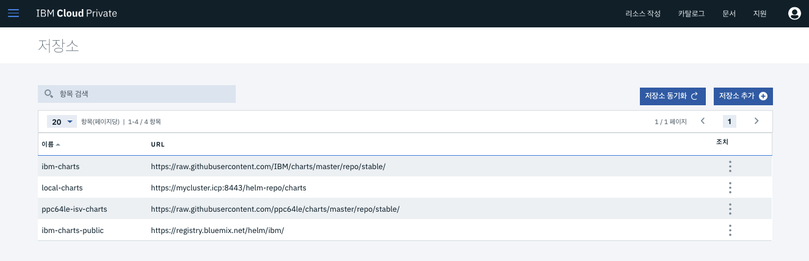
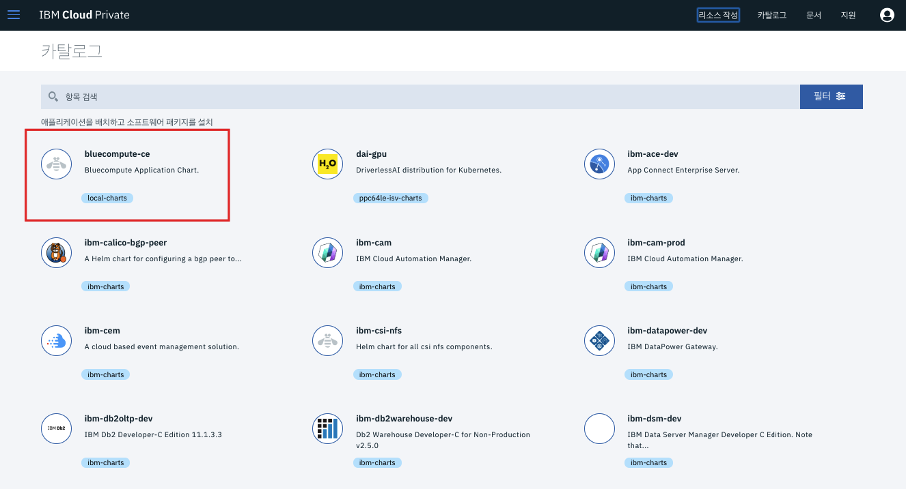
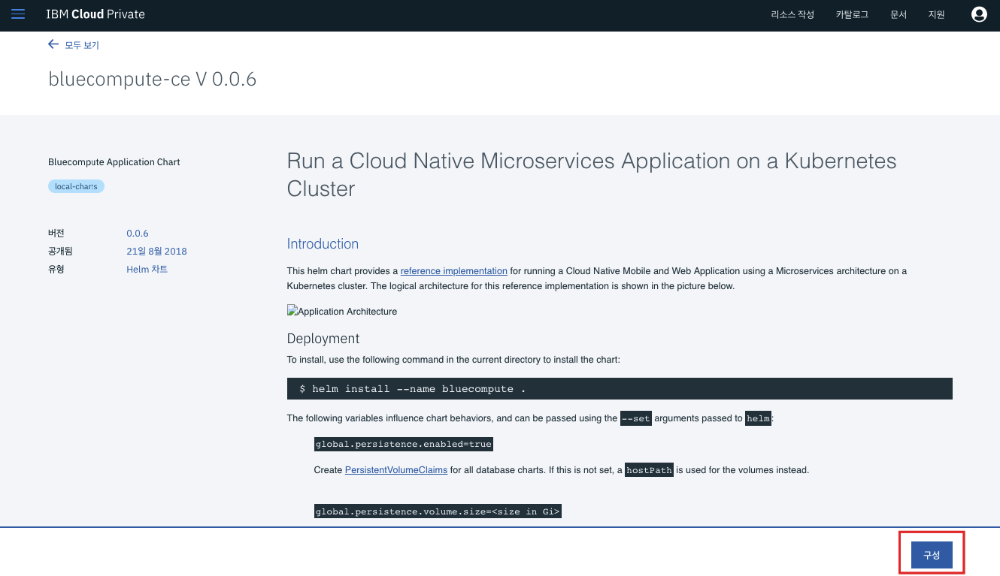
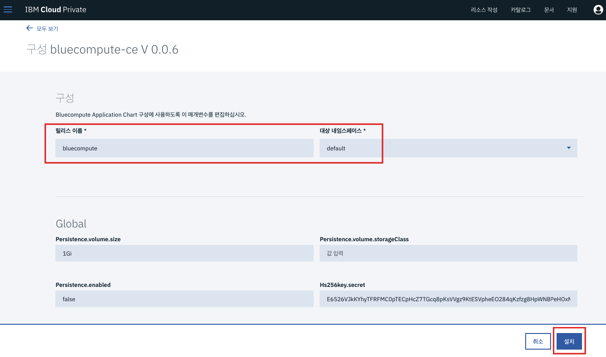
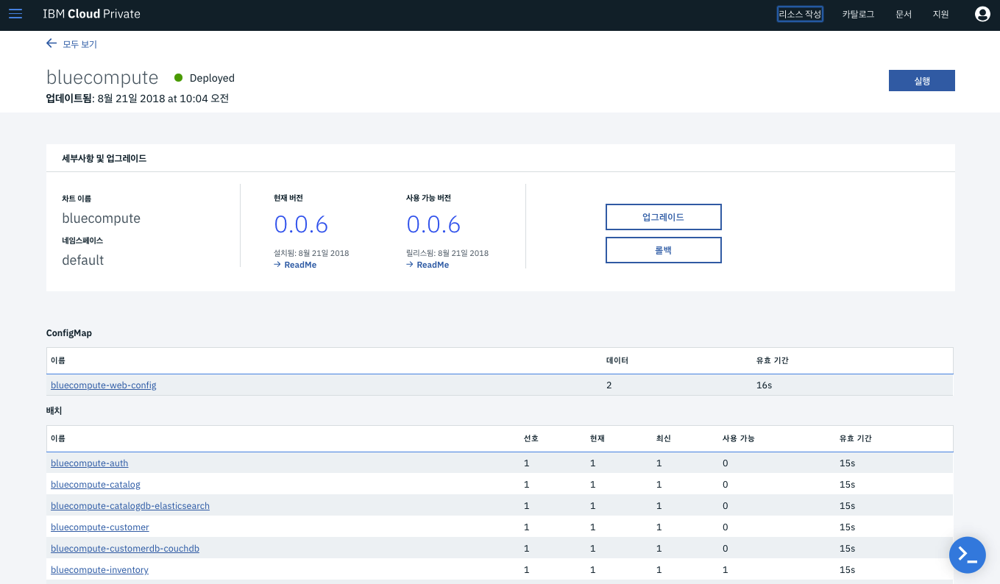
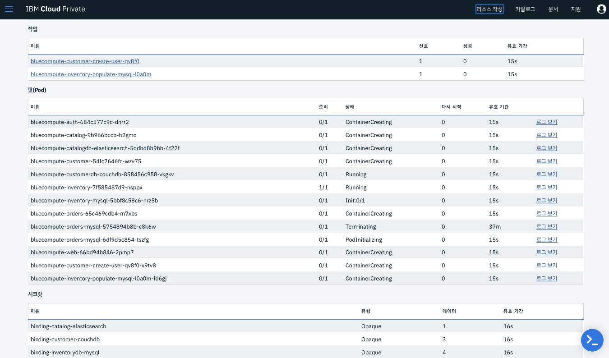
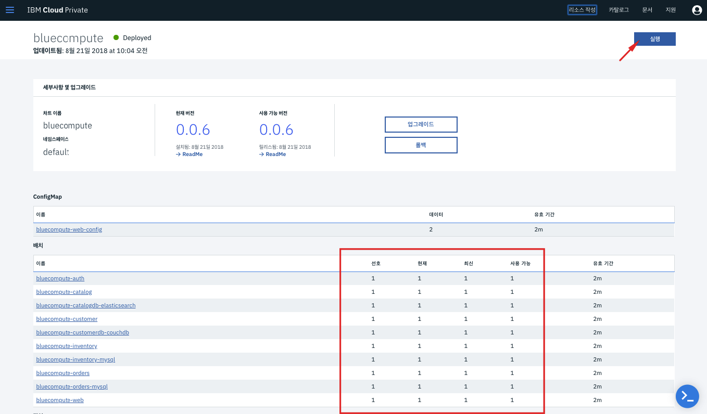
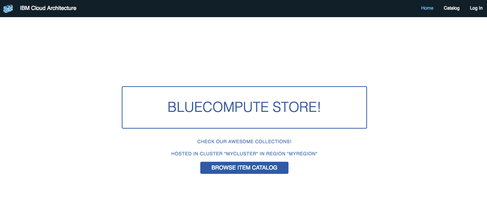

# Custom Helm Chart 배포하기

본 튜토리얼에서는 아래의 아키텍처와 같이 여러개의 마이크로서비스 (앱 + DB)로 구성된 Helm Chart 패키지를 카탈로그에 업로드하여,
카탈로그에서 배포해봅니다.

IBM Cloud Private은 Kubernetes 패키지 매니저인 오픈소스 Helm 을 사용하여
템플릿 기반의 배포를 할 수 있습니다.
복잡한 리소스 구성 (Deployment, Jobs, Volume, Network 설정, Configuration, Secret 정보 등) 일지라도 템플릿으로 만들어 개발자간 공유하고 효율적으로 손쉽게 배포할 수 있습니다.

나만의 카탈로그 서비스 (Helm Chart) 만드는 법은 다음에 알아보기로 하고,
오늘은 이미 만들어진 Helm Chart를 _**1. 업로드**_ 하고 _**2.배포**_ 해보겠습니다. 

아, 추가로 한가지 더!
이번에 배포할 Helm Chart는 컨테이너 이미지까지 패키징 된 오프라인 패키지 (PPA)입니다. 
오프라인 패키지는 이미지까지 모두 패키징 되어 있어, 인터넷이 안되는 오프라인 환경에서도 별도의 DockerHub 등의 외부로부터 이미지 Pull 해오는 작업 없이 배포할 수 있습니다.

## 1. 내가 직접 제작한 Helm Chart 패키지를 카탈로그에 업로드하기

1. ~bx pr~ 명령어 (IBM Cloud Private CLI) 가 설치되어 있는지 확인합니다. 설치되어 있다면 로그인합니다. 
~~~
bx pr login -a https://mycluster.icp:8443 --skip-ssl-validation
~~~

2. Bluecompute PPA 패키지 위치로 이동후 PPA 패키지를 업로드 합니다. 
Helm Chart를 카탈로그에 업로드하는 하는 명령어는 두가지가 있습니다. 저희는 Docker Image 까지 포함된 패키지를 로드하므로 아래 *load-ppa-archive* 명령어를 사용합니다.

* load-helm-chart : Loads a Helm chart archive to an IBM Cloud Private cluster.
* load-ppa-archive : Load Docker images and Helm charts compressed file that you downloaded from Passport Advantage.

~~~
bx pr load-ppa-archive --archive bluecompute-ce-ppa-0.0.6.tgz
~~~

이제 이미지가 로드되기 시작합니다. (컨테이너 이미지 용량이 작지 않으므로 여기서 시간이 다소 걸립니다.)

3. Helm 저장소 둘러보기 
IBM Cloud Private은 기본적으로 로컬 저장소를 사용합니다. 지금 업로드하는 커스텀 패키지도 로컬 저장소에 저장이 됩니다. 
그 외에도 IBM 에서 기본적으로 제공하는 다양한 Chart를 사용할 수 있는 Repository 등을 제공하며, 
별도의 Repository를 추가할 수도 있습니다.
예를 들어 Kubernetes 에서 제공하는 다양한 Helm Chart들을 바로 Import하여 사용할 수도 있고요. 
(https://kubernetes-charts.storage.googleapis.com/)

IBM Cloud Private 웹 관리 콘솔에 로그인 후 왼쪽 메뉴에서 *관리 > Helm 저장소* 로 들어가면 다양한 저장소를 볼 수 있습니다.

4. 로드가 다 되었으면 업로드된 Helm Chart를 확인하기 위해 *우측 상단 카탈로그* 를 클릭

5. 카탈로그에서 *bluecompute* 를 검색 후 클릭합니다.

6. README 내용을 통해 배포할 서비스 내용 확인 후 우측 하단의 *구성* 클릭

7. 배포할 서비스 (릴리즈)의 이름과 배포할 타겟 Namespace를 입력합니다. 그 외 필요한 Parameter 값들도 입력하는데, 본 서비스는 디폴트 값으로 배포하면 되기에 이름과 namespace만 입력합니다. 이후 *설치* 클릭

8. 배포 완료 안내 화면이 뜨면 *Helm Release 보기* 클릭

9. 이제 10개의 마이크로서비스가 하나씩 뜨기 시작합니다. Pod 별 배포 상태를 확인할 수 있습니다. 

10. 모든 Pod의 상태가 *1* 로 표기되면 실행 상태이며 사용 가능한 상태입니다. 모두 실행 상태이면 우측 상단의 *실행* 버튼을 클릭합니다.

11. 컴퓨터를 구매할 수 있는 Bluecompute 쇼핑몰 사이트가 실행되었습니다! 로그인 (user/password) 도 하고, 카탈로그에서 상품을 장바구니에 담을 수도 있습니다. :)

위의아키텍처에서 보신 바와 같이 본 서비스는 여러개의  DB와 APP으로 이루어진 마이크로서비스 집합입니다. 서비스간 통신에 필요한 Secret 정보가 분리되어 배포되며, 사용자를 DB에 등록하기 위한 Job 도 함께 배포되었습니다. 이렇듯 복잡한 조합의 서비스들을 Helm Chart를 통해 템플릿화된 서비스로 쉽게 배포할 수 있습니다.
