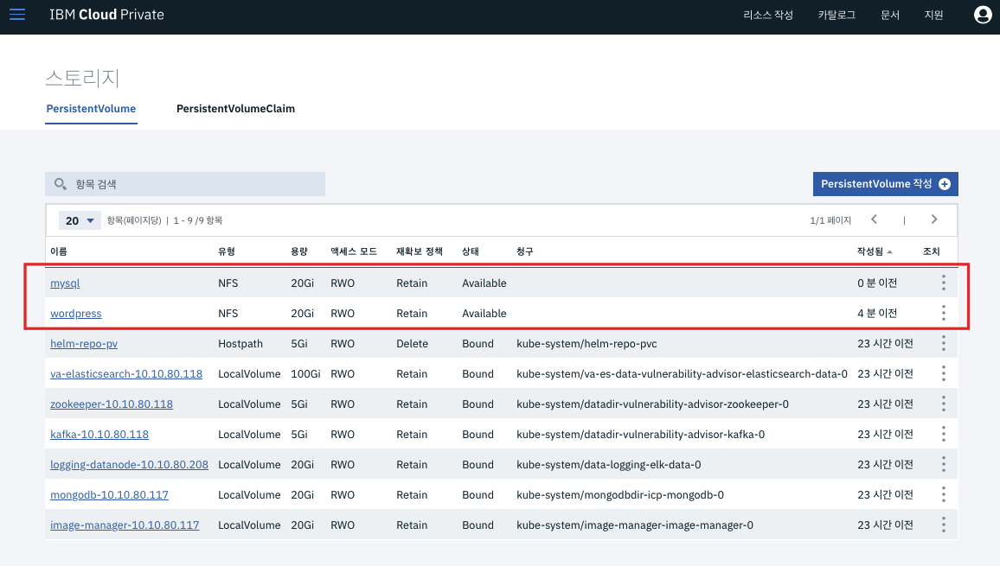
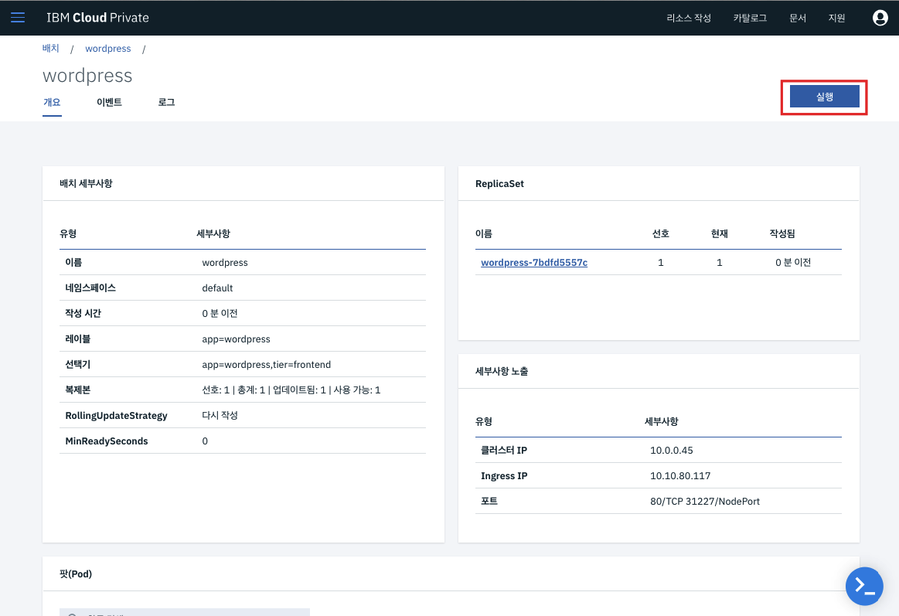

# MySQL과 Wordpress 자원을 Kubernetes (IBM Cloud Private)에 배포하기

본 튜토리얼은 Kubernetes 문서에 있는 **Example: Deploying WordPress and MySQL with Persistent Volumes** 내용을 
NFS 와 연계하여 IBM Cloud Private에 배포하는 튜토리얼입니다. 원본은 아래 링크를 참고하시기 바랍니다.
https://kubernetes.io/docs/tutorials/stateful-application/mysql-wordpress-persistent-volume/
 
 
 이번 튜토리얼에서는 크게 4가지를 수행합니다.
1. NFS 구성 및 PersistentVolumes 생성하기
2. Secret 생성하기
3. MySQL 배포하기
4. WordPress 배포하기

## [1] NFS 구성 및 PersistentVolumes 생성하기

MySQL과 PHP 기반의 Wordpress 웹사이트가 NFS를 사용하도록 하기 위해 NFS 를 먼저 구성합니다. 
1. NFS 서버에 접속 후 마운트 된 폴더로 이동

2. NFS 설정 : Wordpress와 MySQL을 위한 각각의 폴더 생성 후 권한 부여
~~~
mkdir wordpress
chmod 777 wordpress
~~~

~~~
mkdir wordpress-mysql
chmod 777 wordpress-mysql
~~~

3. Persistent Volume 생성하기 위해 **IBM Cloud Private 웹 관리 콘솔 > 메뉴 > 플랫폼 > 스토리지** 로 이동
4. **PersistentVolume작성** 버튼 클릭

5. 아래와 같이 내용 입력하여 Wordpress를 위한 PersistentVolume 생성
- Volume 할당량 : 20Gi
- 액세스 정책 : 한번만 읽고 쓰기 (RWO)
- NFS 서버 IP : 10.10.80.199
- wordpress 폴더 경로 : /storage/wordpress

Voulume이 생성 되었으며 가용한 상태입니다.

6. MySQL을 위한 PersistentVolume 생성
- Volume 할당량 : 20Gi
- 액세스 정책 : 한번만 읽고 쓰기 (RWO)
- NFS 서버 IP : 10.10.80.199
- wordpress 폴더 경로 : /storage/wordpress-mysql

## [2] Secret 생성하기

1. 아래의 명령어를 실행해 MySQL을 위한 Secret을 생성합니다.
~~~
kubectl create secret generic mysql-pass --from-literal=password=YOUR_PASSWORD
~~~

저는 간단하게 패스워드를 ~password~ 로 입력했습니다.
~~~
kubectl create secret generic mysql-pass --from-literal=password=password
~~~

2. Secret 생성 여부를 확인합니다.

~~~
kubectl get secrets
~~~

## [3] MySQL 배포하기
MySQL 을 배포하기 위해 컨테이너가 실행되는 **Deployment** 와 Deployment를 외부로 노출할 **Service**가 필요합니다.
Kubernetes에서는 이런 자원들을 GUI, CLU에서 만들 수 있으며, 또한 YAML형태로 배포하여 생성할 수도 있습니다.
*YAML* 파일에 정의된 내용을 확인하시기 바랍니다. 
본 튜토리얼에서는 YAML 형태로 Kubernetes의 자원을 배포하겠습니다. 

1. 리소스를 작성하기 위해 웹 관리 콘솔로 이동 (CLI에서도 가능하며, 편의상 GUI사용)
2. 우측 상단의 **리소스 작성** 클릭

3. 기존에 있는 두 줄의 내용 삭제 후 복사한 내용 붙여넣은 다음 **작성** 클릭

~~~
application/wordpress/mysql-deployment.yaml  
apiVersion: v1
kind: Service
metadata:
  name: wordpress-mysql
  labels:
    app: wordpress
spec:
  ports:
    - port: 3306
  selector:
    app: wordpress
    tier: mysql
  clusterIP: None
---
apiVersion: v1
kind: PersistentVolumeClaim
metadata:
  name: mysql-pv-claim
  labels:
    app: wordpress
spec:
  accessModes:
    - ReadWriteOnce
  resources:
    requests:
      storage: 20Gi
---
apiVersion: apps/v1 # for versions before 1.9.0 use apps/v1beta2
kind: Deployment
metadata:
  name: wordpress-mysql
  labels:
    app: wordpress
spec:
  selector:
    matchLabels:
      app: wordpress
      tier: mysql
  strategy:
    type: Recreate
  template:
    metadata:
      labels:
        app: wordpress
        tier: mysql
    spec:
      containers:
      - image: mysql:5.6
        name: mysql
        env:
        - name: MYSQL_ROOT_PASSWORD
          valueFrom:
            secretKeyRef:
              name: mysql-pass
              key: password
        ports:
        - containerPort: 3306
          name: mysql
        volumeMounts:
        - name: mysql-persistent-storage
          mountPath: /var/lib/mysql
      volumes:
      - name: mysql-persistent-storage
        persistentVolumeClaim:
          claimName: mysql-pv-claim
~~~

4. 배포된 Deployment, Service 확인

## [4] Wordpress 배포하기

1. 위의 절차와 같이 **리소스 작성** 항목에서 YAML 파일 붙여넣기
~~~
apiVersion: v1
kind: Service
metadata:
  name: wordpress
  labels:
    app: wordpress
spec:
  ports:
    - port: 80
  selector:
    app: wordpress
    tier: frontend
  type: LoadBalancer
---
apiVersion: v1
kind: PersistentVolumeClaim
metadata:
  name: wp-pv-claim
  labels:
    app: wordpress
spec:
  accessModes:
    - ReadWriteOnce
  resources:
    requests:
      storage: 20Gi
---
apiVersion: apps/v1 # for versions before 1.9.0 use apps/v1beta2
kind: Deployment
metadata:
  name: wordpress
  labels:
    app: wordpress
spec:
  selector:
    matchLabels:
      app: wordpress
      tier: frontend
  strategy:
    type: Recreate
  template:
    metadata:
      labels:
        app: wordpress
        tier: frontend
    spec:
      containers:
      - image: wordpress:4.8-apache
        name: wordpress
        env:
        - name: WORDPRESS_DB_HOST
          value: wordpress-mysql
        - name: WORDPRESS_DB_PASSWORD
          valueFrom:
            secretKeyRef:
              name: mysql-pass
              key: password
        ports:
        - containerPort: 80
          name: wordpress
        volumeMounts:
        - name: wordpress-persistent-storage
          mountPath: /var/www/html
      volumes:
      - name: wordpress-persistent-storage
        persistentVolumeClaim:
          claimName: wp-pv-claim
~~~

2. 배포된 Deployment, Service 확인 

3. **실행** 버튼을 클릭해 Wordpress 를 실행합니다. 언어 선택 후 Wordpress를 사용할 수 있습니다.

